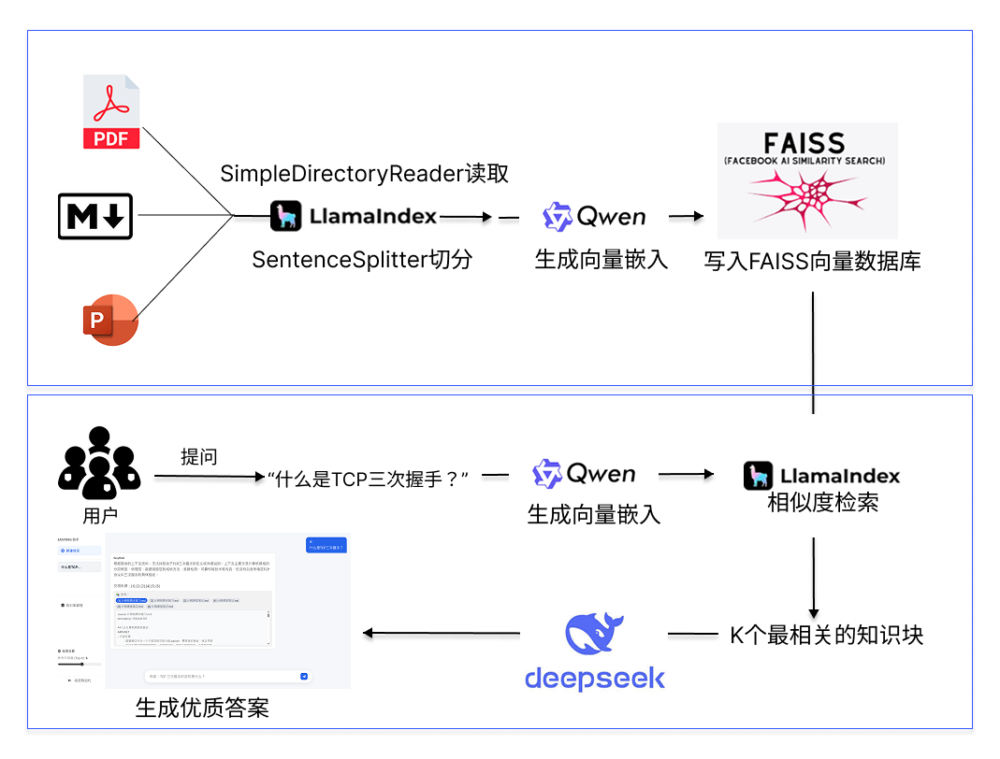

<div align="center">
  
  <h2>通用中文 RAG 助手</h2>
  
  <p>
    <!-- Tech stack row 1 -->
    
    
    
    
    
    
    
    
  </p>
  <p>
    <!-- Tech stack row 2 -->
    
    
    
    
    
    
  </p>
</div>

一个轻量、可复用的中文 RAG 助手，支持**多知识库管理**：
- 后端：FastAPI + LlamaIndex + FAISS
- 嵌入：通义千问 Qwen（DashScope，text-embedding-v4，固定 1024 维）
- 生成：DeepSeek-V3.2-Exp 的非思考模式
- 前端：Vite + React（TS），提供知识库管理 + 对话问答页面
<p align="center">
  
</p>

---

<p align="center" style="margin-top: -8px;">
  <a href="#快速开始">快速开始</a>
  · <a href="#api-速览">API</a>
  · <a href="#特性与实现要点">特性</a>
  · <a href="#目录结构">结构</a>
  · <a href="#常见问题troubleshooting">常见问题</a>
</p>

## 快速开始

网页端需要先在 `backend/.env` 填入：
`QWEN_API_KEY`、`DEEPSEEK_API_KEY`（可选：`DEEPSEEK_MODEL`、`DEEPSEEK_BASE_URL`）。

### 网页端（开发/部署）
```bash
# 后端
cd backend
python -m pip install -U -r requirements.txt
uvicorn main:app --reload --port 8000 --reload-exclude data

# 前端（另一个终端）
cd frontend/vite-react
npm install
npm run dev  # http://localhost:5173
```
## API 速览

- `GET /health`：存活检查
- `GET /kb`：列出所有知识库（ID + 展示名 + 文档数量）
- `POST /kb`：创建知识库（Body: `{ "name": "中文名称" }`，自动生成英文 ID 作为目录名）
- `GET /kb/{kb}/files`：查看某个知识库中的文件列表
- `POST /kb/{kb}/upload`：向指定知识库上传文档并可选重建索引（FormData: `files[]`, `rebuild`）
- `POST /kb/{kb}/rebuild`：手动重建指定知识库索引
- `POST /ingest`：Body `{ "kb": "kb_id", "rebuild": true }`，从该知识库对应的 RAW 目录重建索引
- `POST /ask`：Body `{ "kb": "kb_id", "question": "中文问题", "top_k": 6 }`，在指定知识库上进行 RAG 问答

示例
```bash
curl -s http://localhost:8000/health
curl -s -X POST http://localhost:8000/kb -H "Content-Type: application/json" -d '{"name":"计算机网络"}'
curl -s -X POST http://localhost:8000/ingest -H "Content-Type: application/json" -d '{"kb":"my_kb","rebuild":true}'
curl -s -X POST http://localhost:8000/ask -H "Content-Type: application/json" -d '{"kb":"my_kb","question":"什么是计算机网络？"}'
```

---

## 特性与实现要点

- 资料解析与切分：`SimpleDirectoryReader` + `SentenceSplitter(chunk_size=1000, overlap=120)`，保留 `source/page/timestamp` 元信息
- 向量化与索引：Qwen 1024 维嵌入 → FAISS（L2），索引持久化到 `INDEX_DIR`
- 检索与拼接：Top‑K（默认 6），按 ~2500 tokens 预算裁剪上下文并编号 `[1][2]…`
- 生成策略：DeepSeek 低温度中文回答，仅依据上下文；不足即明确说明找不到
- 跨平台稳健：相对路径自动锚定到 backend；索引加载支持 FAISS 直读与 LlamaIndex 存储

## 目录结构（多知识库）
```
backend/
  app/
    api/            # /health, /kb, /ingest, /ask
    core/           # settings, embed(qwen), index, retriever, rag, generator
    models/         # Pydantic 请求/响应
  data/
    raw/            # 原始资料根目录（按知识库划分子目录 raw/<kb_id>/）
    index/          # FAISS 索引根目录（按知识库划分子目录 index/<kb_id>/）
    # raw/_kb_meta.json  # 知识库元数据：{"kbs": {"<kb_id>": {"name": "展示名称"}}}
frontend/
  vite-react/       # 前端工程
```

---

## 常见问题（Troubleshooting）

- 400 无法加载索引：确认指定 `kb_id` 已完成构建（先执行 `POST /ingest` 带 `{"kb":"kb_id","rebuild":true}`，或在 backend 目录下运行 `python build_index.py --kb kb_id --rebuild`，并检查 `backend/data/index/kb_id` 非空）
- 400 DEEPSEEK_API_KEY 未配置或无效：在 `backend/.env` 写入真实密钥并重启后端
- 502 DeepSeek 请求失败：检查网络/代理、`DEEPSEEK_BASE_URL` 与 Key 权限
- 400 RAW_DIR 中没有可用资料：确认 `backend/data/raw` 下存在 `.pdf/.pptx/.md`
- 维度报错：嵌入维度已固定为 1024，如出现不一致请升级 DashScope SDK 并重建索引

---